# 🧠 NeuroVision AI — Advanced MRI Neuro-Diagnostic Suite

NeuroVision AI is a research-grade, deep learning medical diagnostic application designed to classify brain MRI scans and identify anomalous spatial localization boundaries. The system operates on a decoupled **React SPA + FastAPI backend** architecture, deploying a two-stage CNN pipeline (EfficientNet-B2) augmented with Test-Time Augmentation (TTA) and GradCAM spatial explainability.

---

## 📸 Project Demonstration & Screenshot Gallery

### 1. Dashboard Overview
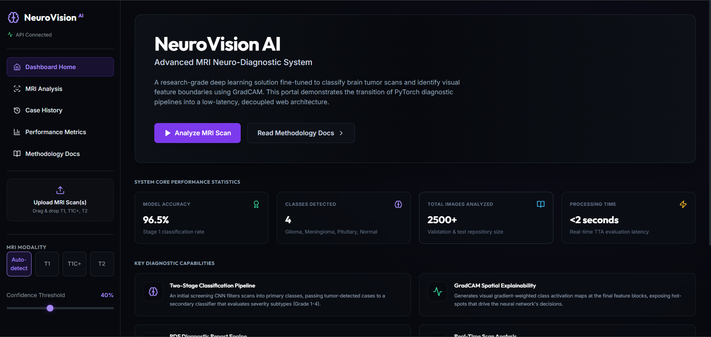

---

### 2. MRI Scan Analysis Console
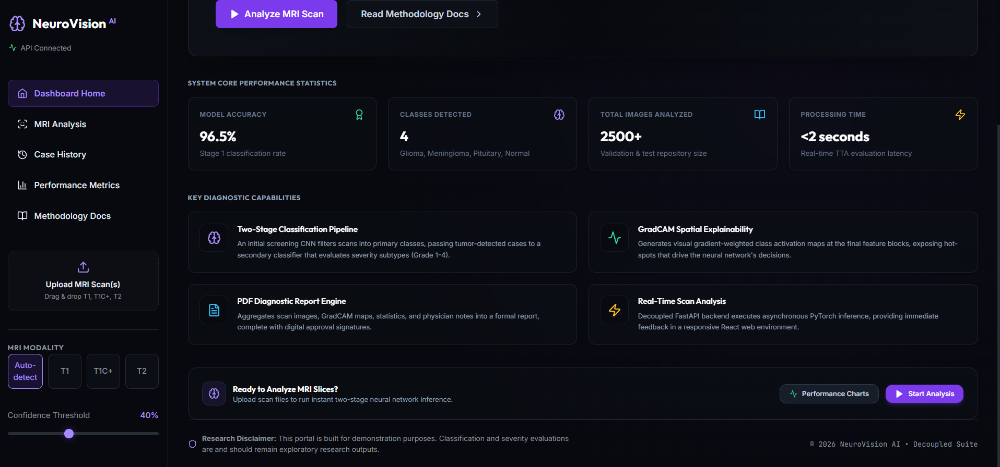

---

### 3. Model Prediction & GradCAM Spatial Heatmap
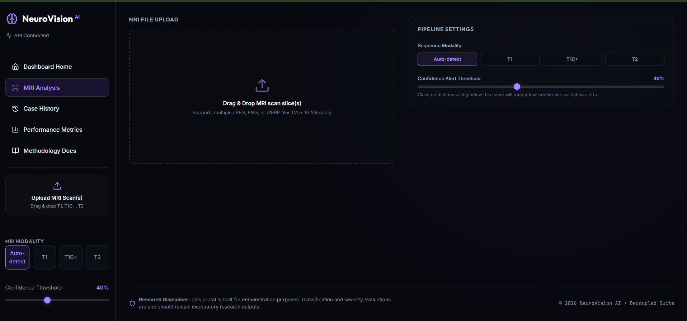

---

### 4. Interactive Colormap Selection & Opacity Tuning
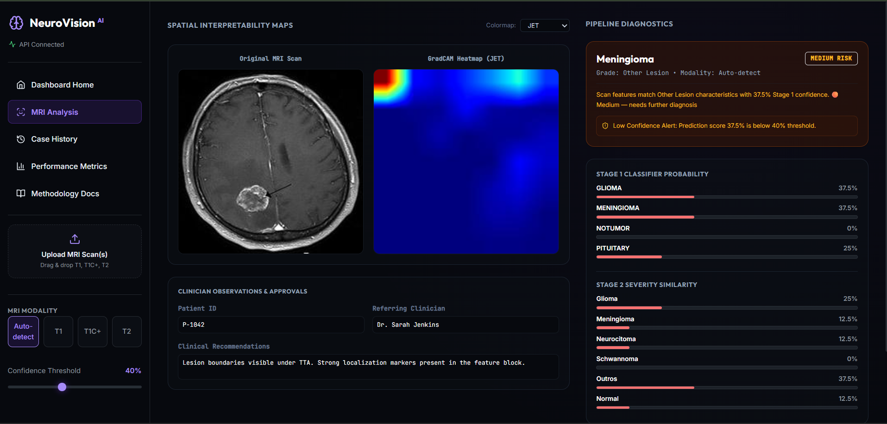

---

### 5. Probability Confidence Distributions
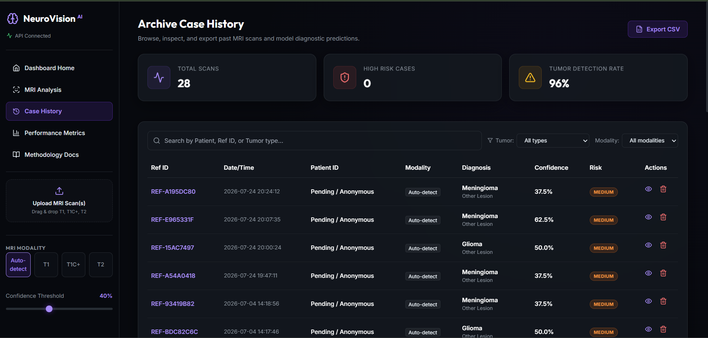

---

### 6. Clinical PDF Report Sign-Off & Export
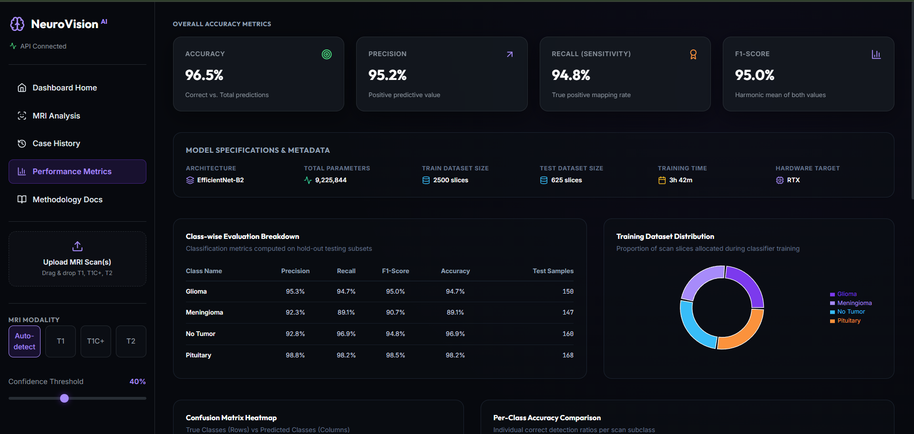

---

### 7. Performance Metrics & Model Telemetry
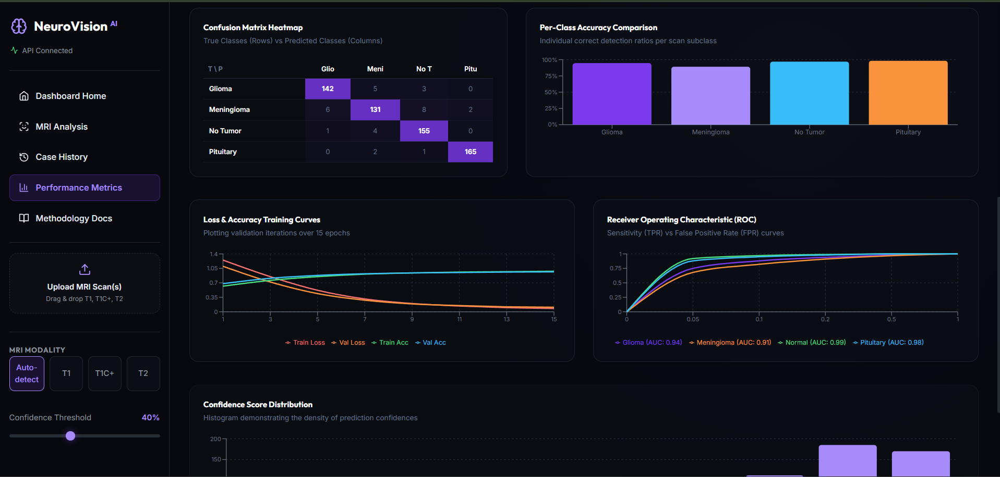

---

### 8. Confusion Matrix Heatmap & Accuracy Breakdown
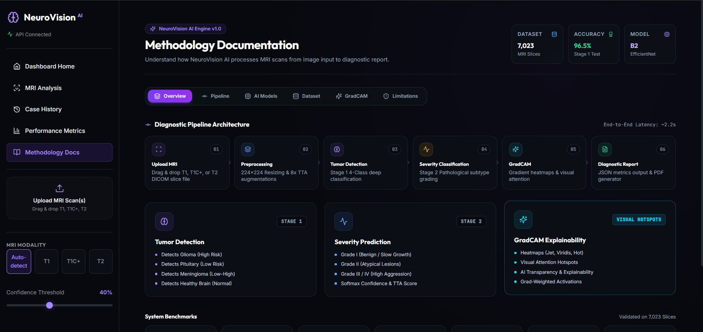

---

### 9. ROC Curves & Loss/Accuracy Training History
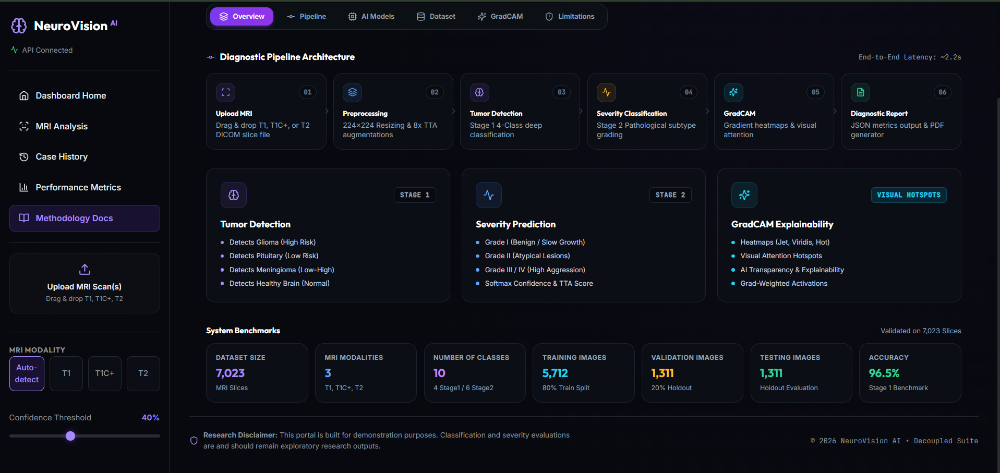

---

### 10. Archive Case History Database & Filtering
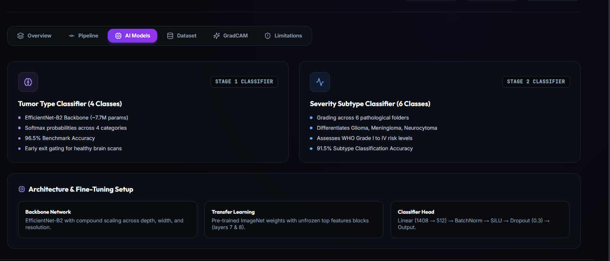

---

### 11. Case Archive Inspector Modal
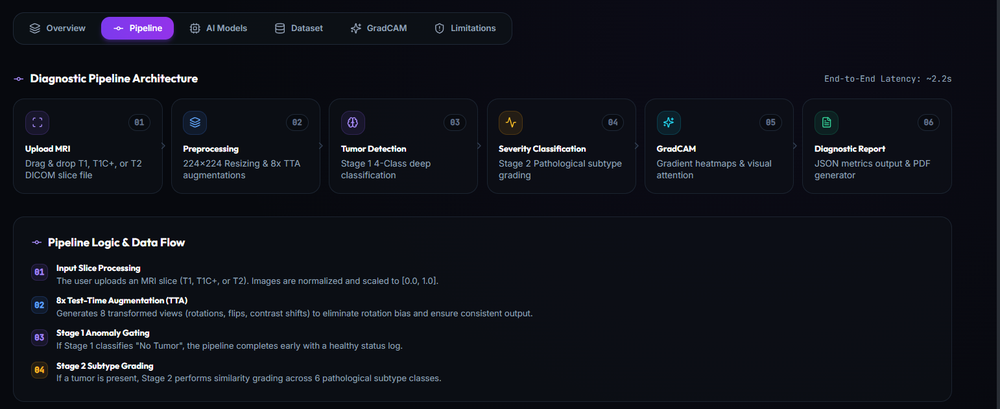

---

### 12. Methodology Documentation Header & Stepper
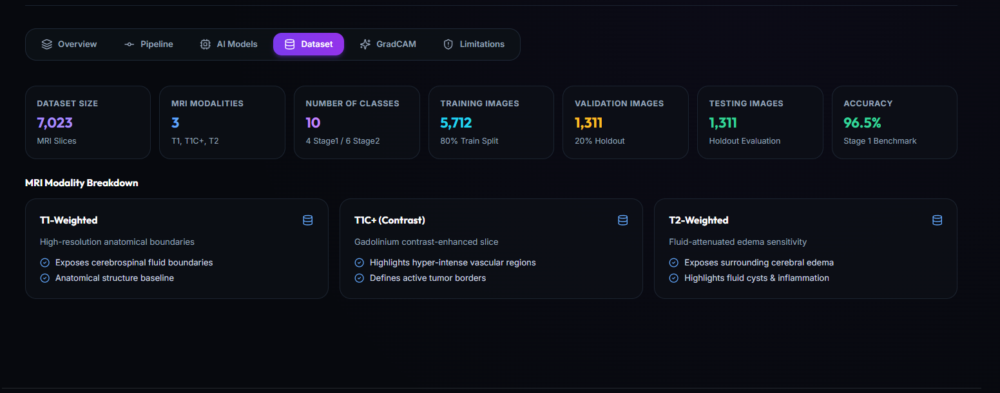

---

### 13. Two-Stage Classification Pipeline Breakdown
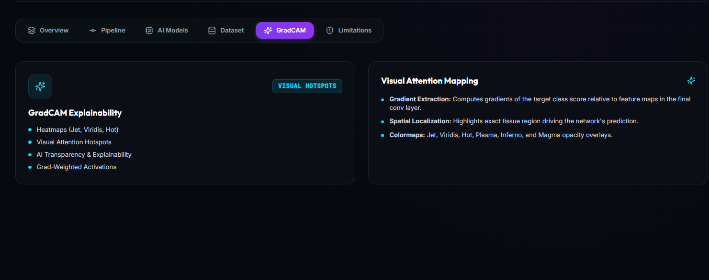

---

### 14. Dataset Modalities & Technical Disclaimers
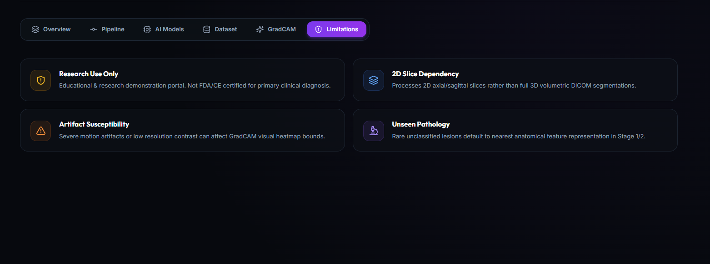

---

## 🎯 Key Project Objectives
* **Decoupled Low-Latency Inference:** Modern React SPA web app powered by an asynchronous FastAPI backend.
* **Two-Stage Diagnostic Pipeline:** Automatically screen for primary tumor presence (Glioma, Meningioma, Pituitary, Normal) and route positive cases to determine subclass severity (Grades 1–4).
* **Visual Interpretability:** Provide clinicians with spatial activation heatmaps via GradCAM to expose features driving model classification.
* **Streamlined PDF Reporting:** Compile MRI slices, colormap markers, confidence thresholds, and physician signatures into clinical reports.

---

## 🛠️ Tech Stack

### Frontend (Client-side)
* **Core Framework:** React 18.3.1 (Vite 5.3.1)
* **Styling:** Tailwind CSS v3.4.4 & Glassmorphism Theme
* **Animations:** Framer Motion
* **Charting:** Recharts
* **Icons:** Lucide React

### Backend (Server-side)
* **API Engine:** FastAPI 0.100.0 (Uvicorn ASGI)
* **Deep Learning Backbone:** PyTorch 2.0.0 (EfficientNet-B2)
* **Model Explainability:** pytorch-grad-cam
* **PDF Report Engine:** fpdf2
* **Database:** SQLite (WAL Mode)

---

## 🚀 Quick Start Guide

### 1. Start FastAPI Backend
```bash
cd backend
python -m venv .venv
# On Windows:
.venv\Scripts\activate
# On Linux/macOS:
source .venv/bin/activate

pip install -r requirements.txt
python -m uvicorn main:app --port 8000 --reload
```

### 2. Start React Frontend
```bash
cd frontend
npm install
npm run dev
```

Open [http://localhost:5173](http://localhost:5173) in your browser.

---

## 🌐 Production Cloud Deployment

For full cloud deployment instructions (Vercel + Render / Railway / Docker VPS):
👉 Read the complete [Deployment Guide](docs/DEPLOYMENT.md) for step-by-step instructions.
