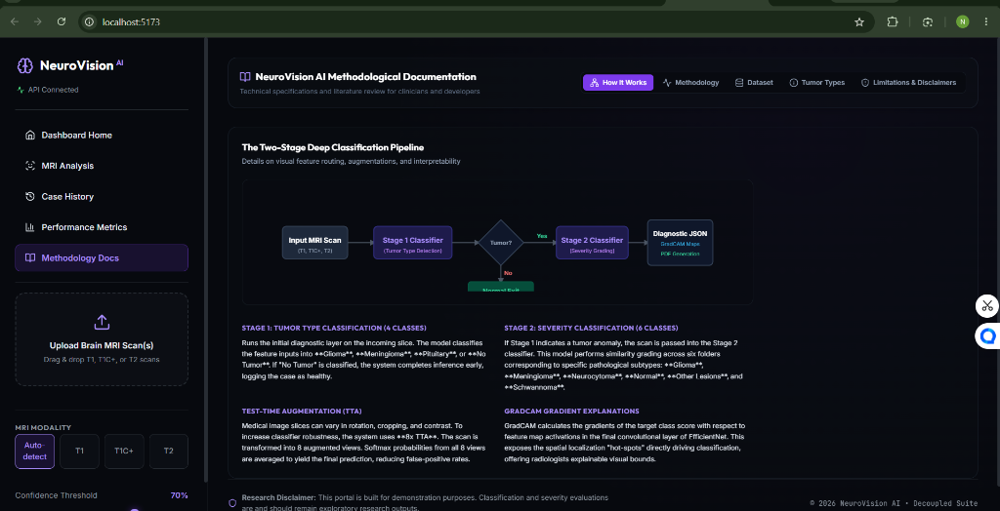
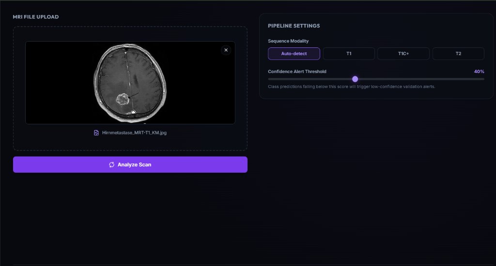
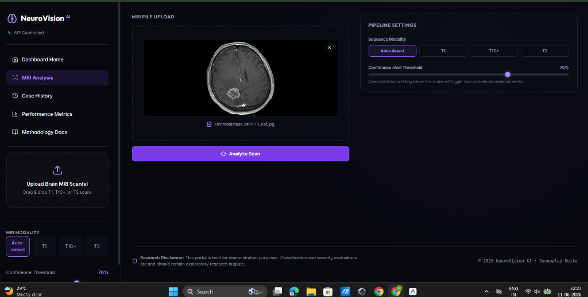
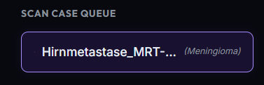

# 🧠 NeuroVision AI — Advanced MRI Neuro-Diagnostic Suite

NeuroVision AI is a research-grade, deep learning medical diagnostic application designed to classify brain MRI scans and identify anomalous spatial localization boundaries. The system operates on a decoupled **React SPA + FastAPI backend** architecture, deploying a two-stage CNN pipeline (EfficientNet-B2) augmented with Test-Time Augmentation (TTA) and GradCAM spatial explainability.

---

## 📸 Interface Screenshots & Gallery

### 1. Modern Methodology Documentation Page
> Redesigned medical AI dashboard UI showcasing scannable methodology tabs, stage 1 & 2 pipeline steppers, dataset statistics, and GradCAM explainability details.


---

### 2. Real-Time MRI Analysis Console
> Interactive MRI slice inspector featuring multi-modality processing, GradCAM activation colormap overlays (Jet, Hot, Viridis, Plasma), probability distribution bars, and digital PDF report signatures.


---

### 3. Model Telemetry & Performance Metrics
> Comprehensive performance charts displaying accuracy breakdowns, confusion matrix heatmaps, training loss curves, ROC sensitivity, and confidence density histograms.


---

### 4. Archive Case History Inspector
> Historical prediction repository with multi-attribute filtering (Patient ID, Modality, Tumor Class), CSV export, and full modal overlay inspection.


---

### 5. High-Level System Architecture
> Overview of the decoupled client-server data flow, PyTorch model caching, asynchronous TTA inference, and automated PDF report generation.


---

## 🎯 Key Project Objectives
* **Decoupled Low-Latency Inference:** Modern React SPA web app powered by an asynchronous FastAPI backend.
* **Two-Stage Diagnostic Pipeline:** Automatically screen for primary tumor presence (Glioma, Meningioma, Pituitary, Normal) and route positive cases to determine subclass severity (Grades 1–4).
* **Visual Interpretability:** Provide clinicians with spatial activation heatmaps via GradCAM to expose features driving model classification.
* **Streamlined PDF Reporting:** Compile MRI slices, colormap markers, confidence thresholds, and physician signatures into clinical reports.

---

## 🛠️ Tech Stack

### Frontend (Client-side)
* **Core Framework:** React 18.3.1 (Vite 5.3.1)
* **Styling:** Tailwind CSS v3.4.4 & Glassmorphism Theme
* **Animations:** Framer Motion
* **Charting:** Recharts
* **Icons:** Lucide React

### Backend (Server-side)
* **API Engine:** FastAPI 0.100.0 (Uvicorn ASGI)
* **Deep Learning Backbone:** PyTorch 2.0.0 (EfficientNet-B2)
* **Model Explainability:** pytorch-grad-cam
* **PDF Report Engine:** fpdf2
* **Database:** SQLite (WAL Mode)

---

## 🚀 Quick Start Guide

### 1. Start FastAPI Backend
```bash
cd backend
python -m venv .venv
# On Windows:
.venv\Scripts\activate
# On Linux/macOS:
source .venv/bin/activate

pip install -r requirements.txt
python -m uvicorn main:app --port 8000 --reload
```

### 2. Start React Frontend
```bash
cd frontend
npm install
npm run dev
```

Open [http://localhost:5173](http://localhost:5173) in your browser.
