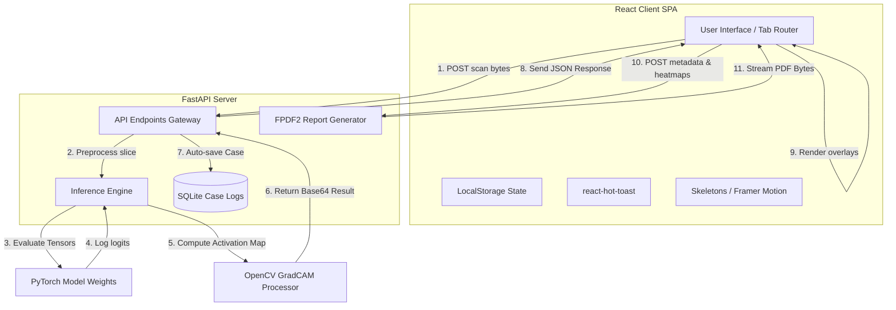
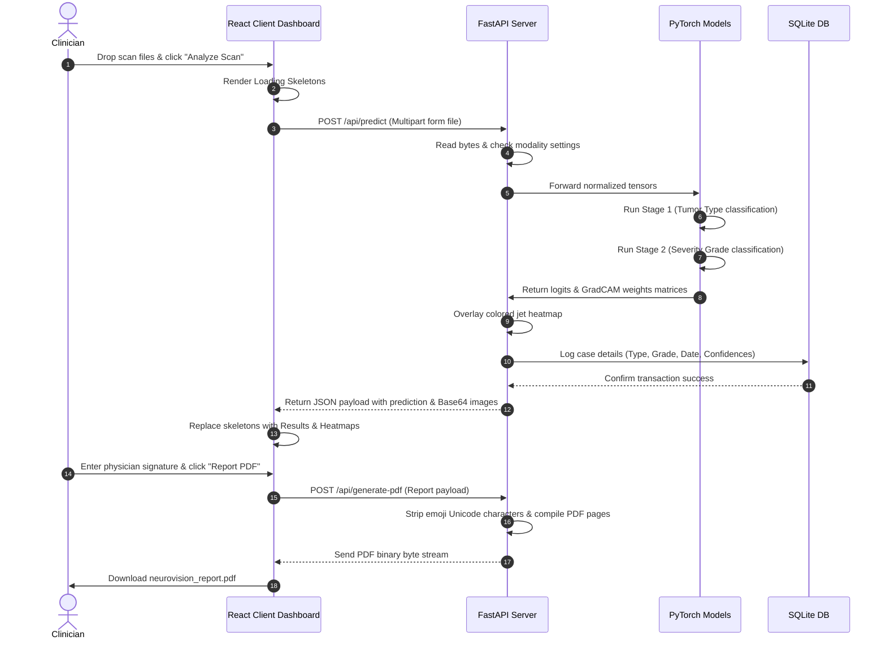

# System Architecture — NeuroVision AI

This document details the software architecture, data flow, and database models implemented in the decoupled NeuroVision AI stack.

---

## 1. System Block Diagram


---

## 2. Component Blueprints

### 2.1 Frontend Architecture (React SPA)
The client-side dashboard is built as an optimized Single Page Application (SPA) utilizing Vite for asset bundling:
- **`App.jsx`**: Manages global routing, active case states, health polling intervals, and sets up `<Toaster />` providers.
- **`components/`**: Reusable interface widgets:
  - `ImageUploader.jsx` & `Dropzone.jsx`: Keyboard-accessible file inputs handling drag-and-drop actions.
  - `CaseQueue.jsx`: Tracks uploaded scans.
  - `ConfidenceBar.jsx`: Visual progress indicators showing model probability percentages.
  - `MetricsCard.jsx` & `GaugeChart.jsx`: Performance summaries rendering metrics on viewport reveals.
- **`pages/`**: View panels swapped inside the layout main frame:
  - `AnalysisPage.jsx`: Active workspace hosting uploader, settings sliders, skeletons, and mock simulation overrides.
  - `HistoryPage.jsx`: Tabular list of past reports pulled from the SQLite database.
  - `ResultsPage.jsx`: Diagnostics telemetry curves.
- **`utils/errorHandler.js`**: Friendly Clinician Error Parser.

### 2.2 Backend Architecture (FastAPI ASGI)
The server layer acts as an asynchronous API gateway communicating with scientific libraries:
- **`main.py`**: Boots FastAPI, configures CORS, and exposes endpoints:
  - `GET /health`: Uptime checking.
  - `POST /api/predict`: Runs single MRI image inference.
  - `POST /api/predict/batch`: Sequentially/parallelly uploads and processes scan array.
  - `POST /api/generate-pdf`: Compiles scan findings and clinician notes to a PDF document.
  - `GET /api/history`: Retrieves saved patient metrics database records.
- **`src/report.py`**: Compiles PDF streams with explicit DejaVuSans font configuration. Strips color emojis to prevent compiler failure.
- **`src/model.py`**: Instantiates double backbone classifiers (ResNet/EfficientNet models) in PyTorch evaluation mode.

---

## 3. Detailed Data Flow


---

## 4. SQLite Database Schema
The database logging leverages a lightweight SQLite table schema. 

### 4.1 `predictions` Table Definition
```sql
CREATE TABLE IF NOT EXISTS predictions (
    id VARCHAR(50) PRIMARY KEY,       -- Format: CASE-XXXXXX-PATIENTID
    patient_id VARCHAR(50) NOT NULL,   -- Patient identifier
    tumor_type VARCHAR(50) NOT NULL,   -- Classified Tumor (Glioma, Meningioma, etc.)
    severity_class VARCHAR(50) NOT NULL,-- Classified Severity (Grade I, Grade II, etc.)
    risk_level VARCHAR(20) NOT NULL,   -- Assessment (LOW, MEDIUM, HIGH)
    top_confidence REAL NOT NULL,      -- Model probability (e.g. 95.6)
    created_at TIMESTAMP DEFAULT CURRENT_TIMESTAMP -- Datetime of inference
);
```
