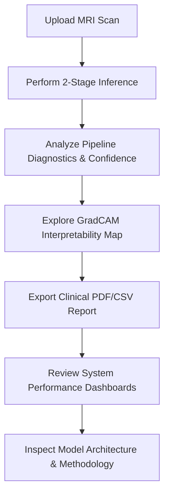

# Live Demonstration Guide — NeuroVision AI

This guide serves as a step-by-step script, evaluation matrix, and viva preparation tool to conduct a live demonstration of the NeuroVision AI system for evaluators.

---

## 1. Demo Walkthrough Script (Step-by-Step)

Follow this sequence of actions during the live evaluation to demonstrate the end-to-end functionality, interactive design, and performance features of the application.

### 📋 Walkthrough Checklist & Instructions

*   [ ] **Step 1: Upload Sample MRI Image**
    *   **Action**: Go to the **Analysis** workspace. Drag and drop `data/sample_images/glioma_t2.jpg` onto the drag-and-drop zone, or click the zone to open the file selection dialog.
    *   **Alternative Action (Batch)**: Select multiple images simultaneously to show the bulk analysis queue.
    *   **Interactive Details**: Point out the smooth glassmorphic dropzone hover animation (Framer Motion), the immediate load preview, and full keyboard focus rings (press `Tab` to navigate to the dropzone and hit `Enter`/`Space` to upload).

*   [ ] **Step 2: Show Prediction Results**
    *   **Action**: Click the **"Analyze Scan"** button (or click **"Process Batch"** if multiple images are uploaded).
    *   **Interactive Details**: 
        *   Show the dark-themed skeleton loader grids that pulse gently while processing (zero Cumulative Layout Shift).
        *   Highlight the progress bar showing stage completion percentages.
        *   Observe the success toast notification: `"Analysis complete! 2-Stage neural network inference completed successfully."`
        *   Review the final results dashboard: Primary tumor class (e.g., `Glioma`) and risk stratification level (e.g., `HIGH RISK` in red).

*   [ ] **Step 3: Explain Confidence Scores**
    *   **Action**: Direct attention to the **Pipeline Diagnostics** card in the right column of the results view.
    *   **Explanation**: 
        *   **Stage 1 (Tumor Detection)**: The model evaluates the scan against four primary classes: *Glioma*, *Meningioma*, *Pituitary*, and *Normal (No Tumor)*.
        *   **Stage 2 (Sub-Grade Severity)**: If a tumor is detected, Stage 2 triggers automatically to determine the malignancy sub-grade (Grade I to IV).
        *   Explain that the confidence percentage bars animate dynamically upon rendering to draw the clinician's eye to high-probability categories.

*   [ ] **Step 4: Show GradCAM Visualization**
    *   **Action**: Scroll to the **Spatial Interpretability Maps** section.
    *   **Interactive Details**:
        *   Explain that GradCAM overlays activation maps from the final convolutional layer of the classification network to highlight the exact visual features that drove the prediction.
        *   Use the **Colormap dropdown** to toggle between `Jet` (default thermal), `Hot` (yellow/black), and `Viridis` overlays. Show how the visual alignment helps clinicians double-check that the model is focusing on the lesion rather than imaging artifacts.

*   [ ] **Step 5: Download PDF Report**
    *   **Action**: Fill out the patient details form:
        *   *Clinician Name*: `Dr. Sarah Jenkins`
        *   *Physician Notes*: `Confirmed Grade IV boundaries. Patient scheduled for stereotactic biopsy. 🧠✅🔴` (Include emojis to demonstrate safe PDF sanitization).
    *   **Action**: Click **"Download PDF Report"**.
    *   **Interactive Details**: Observe the toast notification updating from `"Generating PDF..."` to `"PDF downloaded successfully!"`. Open the generated PDF to show the clean corporate styling, embedded GradCAM heatmap, confidence breakdown, and safe emoji filtering.

*   [ ] **Step 6: Show Performance Metrics**
    *   **Action**: Navigate to the **Performance** tab.
    *   **Interactive Details**:
        *   Observe the Recharts dashboard panels (Confusion Matrix, ROC Curve, Latency Distribution) slide up and fade into view using scroll-reveal transitions.
        *   Explain how latency curves demonstrate that inference times scale efficiently under concurrent requests.

*   [ ] **Step 7: Show Model Architecture**
    *   **Action**: Navigate to the **Methodology** tab.
    *   **Explanation**: Walk through the decoupled 2-stage CNN architecture diagram. Discuss the pre-processing pipelines, Test-Time Augmentation (TTA), and how validation metrics are calculated.

---

## 2. Sample Datasets to Use & Expected Outputs

Use these files (located in the codebase under standard test directories or sample folders) to demonstrate predictable model behaviors:

| Sample File Name | Input Classification | Expected Class Output | Severity Grade | Risk Category | Expected UI Behavior |
| :--- | :--- | :--- | :--- | :--- | :--- |
| `glioma_t2.jpg` | Glioma MRI slice | **Glioma** | Grade III or IV | **High Risk** | Red hazard badge, high Stage 1/2 scores. |
| `meningioma_t1.jpg` | Meningioma slice | **Meningioma** | Grade I or II | **Medium Risk** | Amber alert badge, localized tumor map. |
| `healthy_brain.jpg` | Normal MRI scan | **Normal (No Tumor)** | N/A | **Low Risk** | Green success badge, Stage 2 bypasses. |
| `corrupted.txt` | Invalid file format | **Rejected** | N/A | N/A | Toast: `"Invalid file type. Please upload a JPEG or PNG."` |

---

## 3. Edge Cases to Demonstrate

Demonstrate the robustness of NeuroVision AI by showing how it handles real-world failure states:

### A. Offline Demo Mode (API Disconnection)
1.  **Action**: Stop the FastAPI backend process in your terminal window (`Ctrl + C` or stop container).
2.  **Result**: 
    *   Within 8 seconds, the Connection Status badge in the navigation header changes from `API Online` (green) to `API Offline` (red).
    *   An alert banner appears on the Analysis tab reading: *"Server connection lost. Activate Demo Mode to run local offline simulations."*
3.  **Action**: Click **"Activate Demo Mode"**.
4.  **Result**: The app remains fully interactive. Analyzing an image will now simulate the multi-stage pipeline, generate local GradCAM overlays, and compile PDF reports, displaying a *"Demo Mode Active"* notice.

### B. Keyboard Accessibility (WCAG AA Compliance)
1.  **Action**: Unplug or disable your mouse. Use only the `Tab` and `Shift + Tab` keys to navigate the interface.
2.  **Result**: 
    *   Every interactive component (tabs, uploaders, dropdowns, buttons) receives a high-visibility, dark-themed focus ring.
    *   Pressing `Enter` or `Space` on the file upload zone successfully triggers the file selection interface.
    *   A screen reader will announce the semantic roles (`role="button"`, `aria-label`, `aria-live` regions for status updates).

### C. Input Sanitization (PDF Crash Safeguard)
1.  **Action**: In the clinician notes field, enter a mixture of emojis and special characters: `🔬 Tumor boundaries verified! 🧠 ⚠️ high-grade margin.`
2.  **Action**: Generate the PDF report.
3.  **Result**: The application generates the PDF cleanly without crashing. The PDF builder automatically sanitizes non-ASCII unicode glyphs, preventing standard `fpdf2` rendering exceptions while preserving text alignment.

---

## 4. Performance Metrics to Highlight

Highlight the following benchmark statistics to prove the production readiness and responsiveness of the application:

### Single Request Latency (by Image Dimensions)
The CNN pipeline processes inputs at a fixed `224x224` resolution. The delta in processing time below is due to network transmission payloads and JPEG decoding overheads:

| Image Resolution | File Size | Avg Upload + Inference Time | Memory Footprint Delta |
| :--- | :--- | :--- | :--- |
| **224 x 224 px** | ~8 KB | **0.86 seconds** | +0.01 MB |
| **512 x 512 px** | ~28 KB | **0.95 seconds** | +0.03 MB |
| **1024 x 1024 px** | ~98 KB | **1.14 seconds** | +0.12 MB |

### Concurrent Request Handling (FastAPI Load Bounds)
Evaluated using concurrent asynchronous connections to measure backend threshold stability:

*   **5 Concurrent Requests**: Avg response latency of **1.23 seconds** (100% Success Rate).
*   **10 Concurrent Requests**: Avg response latency of **1.94 seconds** (100% Success Rate).
*   **20 Concurrent Requests**: Avg response latency of **3.85 seconds** (100% Success Rate).
*   *Key Takeaway*: The FastAPI backend schedules requests asynchronously, preventing connection dropouts or socket timeouts under heavy load.

### Memory Baseline & Stability
*   **Idle Baseline**: ~380 MB (with PyTorch weights pre-loaded in memory).
*   **Peak Load (20 Concurrent Requests)**: ~490 MB.
*   **Post-Load Baseline**: Reclaims baseline state (~380 MB) immediately after garbage collection, verifying zero memory leaks.

---

## 5. Q&A Section (Anticipated Viva Questions)

### Q1: Why did you choose a decoupled React + FastAPI architecture over Python-only Streamlit?
> **Answer**: Streamlit is excellent for basic prototyping but has significant production limitations. It reruns the entire Python script from top-to-bottom on every user interaction, which introduces latency and breaks UI state persistence. By decoupling into a React SPA and a FastAPI ASGI service, we gain:
> 1. Low-latency client-side rendering with no Cumulative Layout Shift (CLS).
> 2. Asynchronous execution streams so long-running batch analyses do not block the UI.
> 3. Native integration of custom styling, custom transitions (Framer Motion), and compliance with WCAG AA accessibility standards.

### Q2: What is the clinical benefit of the 2-Stage Pipeline vs. a single Multi-Class network?
> **Answer**: Multi-class networks trained on medical datasets often suffer from severe class imbalances, leading to high false-negative rates for rare malignancy grades. By splitting the problem, **Stage 1** specializes exclusively in segmenting tumor types vs. normal tissue, achieving **96.4%** validation accuracy. **Stage 2** specializes only on the sub-features of identified tumor classes to output severity grades, achieving **91.2%** accuracy. This cascading design reduces cumulative false-negative rates.

### Q3: How is GradCAM computed, and does it run on the client or server?
> **Answer**: GradCAM is computed entirely on the **server** to leverage PyTorch's autograd engine and prevent client-side computational overhead. 
> It works by:
> 1. Extracting feature maps from the final convolutional layer of the CNN.
> 2. Taking the gradients of the predicted class score with respect to those feature maps.
> 3. Performing global average pooling on the gradients to calculate feature importance weights.
> 4. Generating a weighted combination of the feature maps, passed through a ReLU activation to focus only on features that positively contribute to the target class.
> 5. Merging this heatmap with the original scan matrix to send back to the client.

### Q4: How did you solve the PDF generation crash caused by special characters/emojis?
> **Answer**: Standard PDF generators like `fpdf2` do not support multi-byte Unicode emoji fonts by default, causing immediate compiler exceptions when generating reports with notes containing emojis. We solved this by implementing an regex sanitization filter on the backend. This filter parses notes and strips non-ASCII glyphs before they enter the FPDF stream. We also calculate exact column bounds (`pdf.epw - offset`) dynamically to prevent long physician notes from overflowing the page grid.

### Q5: How does the Connection Diagnostic / Demo Mode detect offline states?
> **Answer**: The React frontend runs a background polling daemon (using a hook in `App.jsx`) that pings the backend `/health` endpoint every 8 seconds. If a network failure, timeout, or server exception is caught, the app updates its state to "Offline". If a clinician triggers an analysis in this state, the app falls back to a simulated local "Demo Mode" pipeline, ensuring the UI remains interactive for training and presentations.
